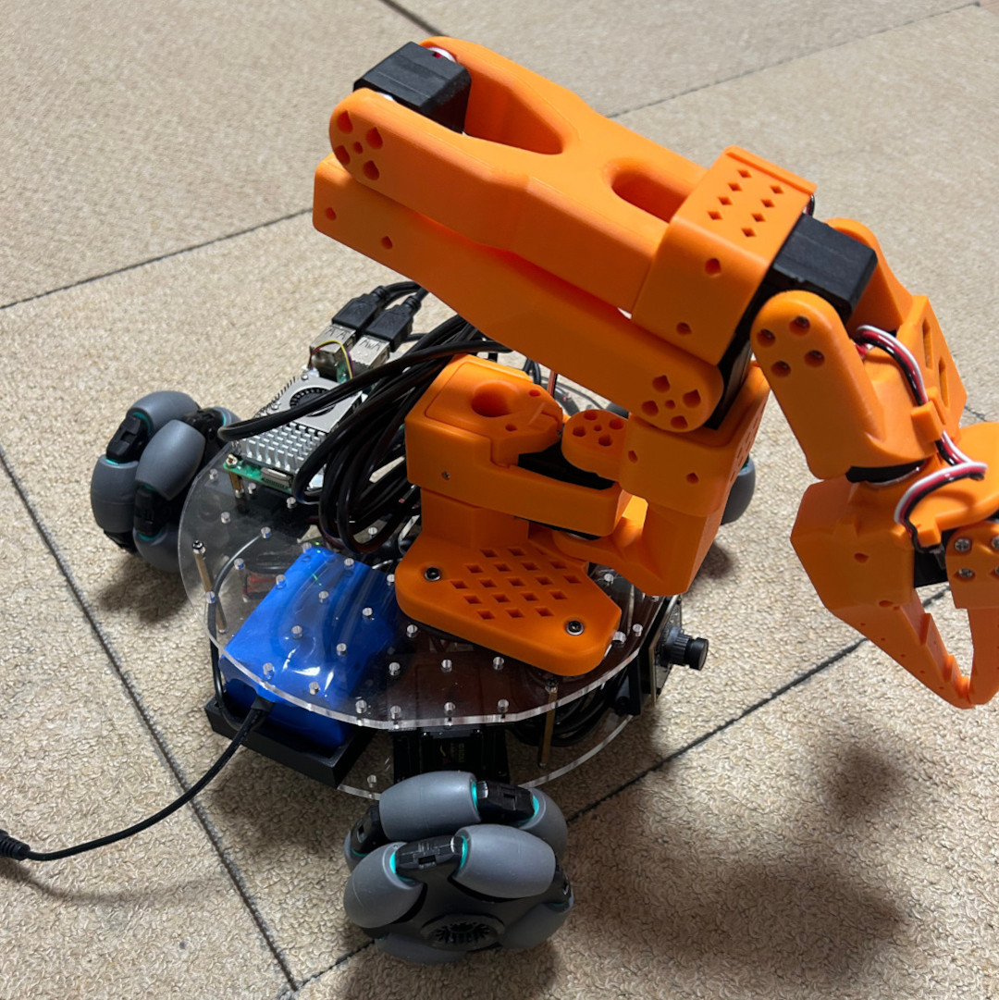
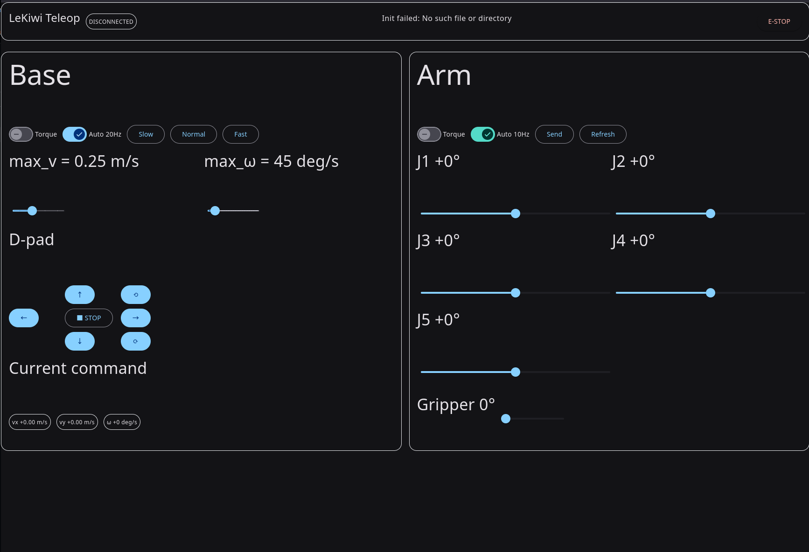

# pylekiwi
[](https://badge.fury.io/py/pylekiwi)

Python package for controlling the LeKiwi robot.



## Quick Start

### Web UI

Log into the robot and run the following command:

```bash
ssh <your robot ip>
sudo chmod 666 <your_follower_robot_serial_port>
uvx pylekiwi webui --serial-port <your_follower_robot_serial_port>
```

Then, open a web browser and navigate to `http://<your robot ip>:8080` to see the web UI.



### Leader and Follower/Client Nodes

Run the following command to start the follower node (host) on the robot (Respberry Pi):

```bash
ssh <your robot ip>
sudo chmod 666 <your_follower_robot_serial_port>
uvx pylekiwi host --serial-port <your_follower_robot_serial_port>
```

Run the following command to start the leader node (client) on the remote machine:

```bash
sudo chmod 666 <your_leader_robot_serial_port>
uvx --from 'pylekiwi[client]' pylekiwi leader --serial-port <your_leader_robot_serial_port>
# Use rerun to view the camera frames
uvx --from 'pylekiwi[client]' pylekiwi leader --serial-port <your_leader_robot_serial_port>
```

Or use the following command to start the leader node (client) on the remote machine:

```bash
uvx pylekiwi client capture --camera base --output photo.jpg
uvx pylekiwi client pose go <name_or_angles>     # preset pose name or "10,20,30,40,50"
uvx pylekiwi client pose save <name>             # save current pose
uvx pylekiwi client pose list                    # list preset poses
uvx pylekiwi client pose delete <name>           # delete preset pose
uvx pylekiwi client position --x-mm 180 --y-mm 0 --z-mm 120  # move EE to absolute position in base frame
uvx pylekiwi client inching --x-mm 10 --z-mm -5  # move EE delta in base frame
uvx pylekiwi client grasp                        # grasp object
uvx pylekiwi client release                      # release object
```

If automatic discovery does not work across machines, you can connect explicitly to the robot:

```bash
# On the robot (Raspberry Pi)
uvx pylekiwi host --serial-port <your_follower_robot_serial_port> --listen-host 0.0.0.0 --listen-port 7447

# On the remote machine
uvx --from 'pylekiwi[client]' pylekiwi leader --serial-port <your_leader_robot_serial_port> --host <your robot ip> --port 7447
uvx pylekiwi client --host <your robot ip> --port 7447 capture --camera base --output photo.jpg
uvx pylekiwi client --host <your robot ip> --port 7447 pose go <name_or_angles>
uvx pylekiwi client --host <your robot ip> --port 7447 position --x-mm 180 --y-mm 0 --z-mm 120
```
